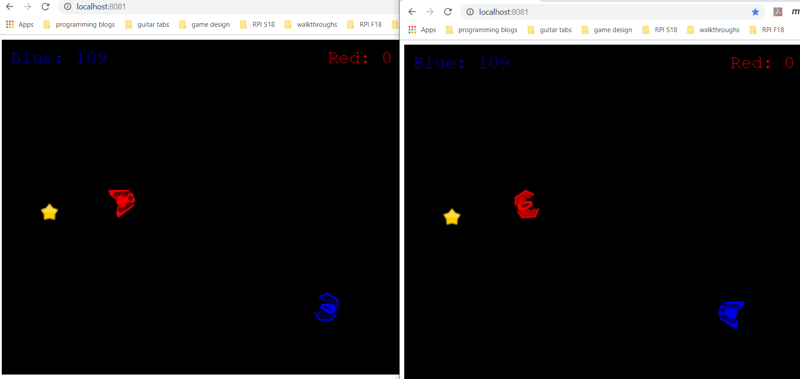

## Learning Resources

Open IO was undertaken by students who knew not what they were doing.
Each of the original contributors has had to learn the technologies used
by Open IO as well as real-time multiplayer game design.

Those curious about Open IO who find themselves in the same position may
benefit from our efforts by exploring the folders contained within this
directory. In them we have placed code from some of our completed tutorials
that help demonstrate the use of Node.js, Express, Socket.io Javasript, and HTML5 Canvas (and React?).

Contained in this folder is the code from some tutorials related to the subject. This document also has links to some relevant tutorials which may help potential contributors learn the technology.

#### Pong with HTML5 Canvas and Javascript

Check out our copy of the [tutorial code](). FIXLINK We tried to make the variable names more readable than in the video, and added comments to help aid understanding for newcomers. You'll also find that our version has been tweaked a bit.

Watch the tutorial on Youtube [here](https://www.youtube.com/watch?v=KoWqdEACyLI).

#### Real-time Multiplayer Game Tutorial with Node.js, Express, and Phaser (a Javascript game engine)

Our copy of the tutorial code can be found [here](). The use of Phaser simplifies the game model and front end issues, but this is a great way to get a sense of how Node.js, Express, and Socket.io are used to send gamestate data between the server and multiple clients. The multiplayer aspects of game design add considerable complexity may help you wrap your head around it. (although it does oversimplify the front end work of drawing the game, handling physics, and synchronizing server/client latency issues)

To test tutorial code, open a node command-line prompt, move to directory containing the server.js file and type "node server.js".
A message will appear saying that the server is listening at a given port.

To test the game locally, connect via a web browser at "localhost:8081".
Do it in multiple tabs/windows to test with multiple clients. The game is controlled with arrow keys, and all the happens here is, players are assigned to a team at random, and when they collect a star, their team scores points. (phaser makes the movement nice and smooth)

Once connections are made, the server will log them to the node terminal:

The original tutorial is in two parts: [part 1](https://gamedevacademy.org/create-a-basic-multiplayer-game-in-phaser-3-with-socket-io-part-1/), [part 2](https://gamedevacademy.org/create-a-basic-multiplayer-game-in-phaser-3-with-socket-io-part-2).

#### Other Resources:

##### Socket.io (with Express)

Here are some links to socket.io videos that helped us get a basic understanding of how we could use socket.io. Following them in order should give enough info to understand Open_IO's usage of sockets.

[Socket.io Tutorial 1](https://www.youtube.com/watch?v=vQjiN8Qgs3c&t=1s)

[Socekt.io Tutorial 2: (using Express)](https://www.youtube.com/watch?v=ggVsXljT0MI)

[Socekt.io Tutorial 3](https://www.youtube.com/watch?v=UwS3wJoi7fY&t=2s)

[Socekt.io Tutorial 4: Emitting](https://www.youtube.com/watch?v=KNqVpESuyQo)

[Socekt.io Tutorial 5: Broadcasting](https://www.youtube.com/watch?v=FvArk8-qgCk)

##### Multiplayer Game design

Here are some links to documents on multiplayer game design issues:

[Multiplayer Game Design](http://buildnewgames.com/real-time-multiplayer/): this is a fantastic intro to multiplayer game design and serves as somewhat of a blueprint for our project

[Client-Server Game Architecture](http://www.gabrielgambetta.com/client-server-game-architecture.html): a brief introduction to common issues

[Source Multiplayer Networking](https://developer.valvesoftware.com/wiki/Source_Multiplayer_Networking): a nice article from the Valve Developer Community about multiplayer game design issues

##### HTML5 Canvas

Canvas is an easy way to create GUI's that is readily available for use in most any we browser with Javascript enabled. Here are some links to guides:

[Sprites with Canvas](https://www.youtube.com/watch?v=W0e9Z5pmt-I)

##### Node.js

Node.js unleashes the power of javascript outside the web browser! Knowing Javascript is now that much more useful. We use it to make our server, here are some links to Node.js guides:

[Node introduction](https://www.youtube.com/watch?v=TlB_eWDSMt4&list=PLPgx4r0FGixlivPRCBuMP0H2WPaEShrlU&index=4&t=0s)
